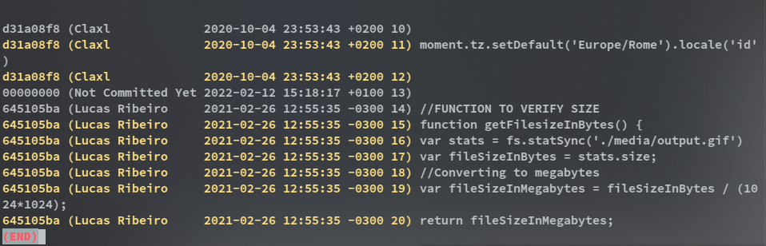

# Week 2

Tutorial on inspecting a repository, taken by instructor Francis.

I’ll be discussing….

Under **Inspecting a repository**, we have:

* Git status.
* Git log.
* Git tag.
* Git Blame.

We’ll be starting with Git status.
<h2><b><p style="text-align: center;">Git status</p></b></h2>

An easy but seriously useful command, it displays the state of our repository. By 'state' i mean, it shows which file has been modified, renamed, newly created and deleted in our repository.

In summary, it lets us see which file have been staged, haven't been staged and files that are currently tracked by Git.

Basic usage:

`git status`


<p style="text-align: center;">Output of Git status</p>

The screenshot/home/francis/Documents/Markdown/Hub/Inspecting a repository/git_log.png shows a typical output of `git status`.

**Untracked files** simply shows files that hasn't been added(staged) to the repository.


<p style="text-align: center;">Output of Git status with files added to staging</p>

After adding 2 files to the staging area, we can see a new entry(Changes to be committed), this entry shows file that were just added to the repository. If we want to remove any(Eg .metadata),we simply use.

`git rm --cached .metadata`

The above command will remove the file from the staging area and return it to the `Untracked files` area since in this case, the files hasn't been committed.


When all files and changes has been committed, the above image is what git status will look like.

Git status shows more information but this is what we'll need half of most of the time.

<h2><b><p style="text-align: center;">Git log</p></b></h2>

An insanely helpful command which shows the commit logs. It can also filter commit


**Note:** HEAD means the topmost commit on that branch, in our case the topmost commit in branch main.

This displays the current commit in branch main, as we can see it's just 1. It also shows commit author, date it was made and it's commit message.

Git log has a bunch of usage option

`git log --stat`

Show the commit history with files which were changed and the amount of changes.

`git log -n <no>`

Limit the number of commit by no.

`git log <file>`

Show only commits associated with the specified file.

Git log has a bunch of other useful options but we discussed only the basic.


<h2><b><p style="text-align: center;">Git tag</p></b></h2>

Well, it's a useful command but which isn't as popular as the some git command since it not needed for a typical git user workflow.

Tag is generally used to capture a point in history of a repository.
For example, we fixed a bug in repository and we what to stop other newer commit from clogging our history or the file which contained the bug fix. We can simply create a tag which will contain all the commit from the beginning(oldest) to the end(newest) commit. Any other commit won't be shown in our tag.

### Creating a tag

**To create a tag, we use:**

`git tag <anyname>`

**To create an annotated tag, we use:**

`git tag -a <anyname>`

*This just added extra information(email,date...) to the default tag*

**To List tags:**

`git tag`

**To delete tag**

`git tag -d <anyname>`

**Note:** Tags can't really be renamed once created and tags can't really be created on top another tag. Really here means it's possible to perform those operation but you have to force the system to do that.

<h2><b><p style="text-align: center;">Git blame</p></b></h2>

From it's name you can guess what it does but lets outline it's function.

`git blame` is similar to the famous imposter game in the sense that, it helps you find whoever made a fault commit or introduced a nice bug. Git blame is mostly used in repository with at least 3 or more users.

Git blame is might be more enjoyable on a GUI/Web.

`git blame` only works on file.



```git blame <file>```
Using `git blame <file>` should give the above screenshot but i added the color option/flag since the default `git blame` could make me blind.

`git blame <file> --color-lines`

`git blame` has a various options which really makes it usage really comfortable

### Some options

**To give output from line 1 to 10**

`git blame -L 1,10 <file>`

**To show commit author email instead of username**

`git blame -e <file>`

They are other options but those won't be covered.

That's all on Inspecting a repository.
